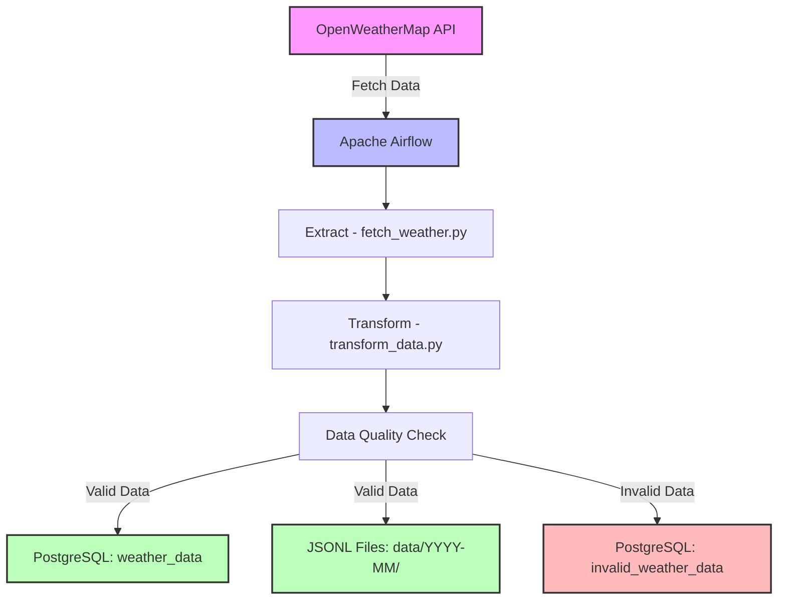
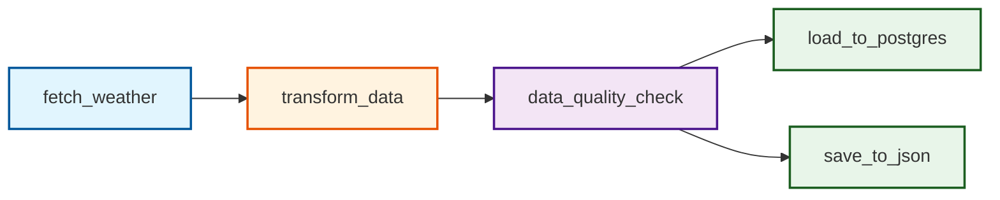

# Automated Weather Collection System

[](https://airflow.apache.org/)
[](https://www.python.org/)
[](https://www.postgresql.org/)
[](https://www.docker.com/)

## 📋 Tổng quan

Automated Weather Collection là một hệ thống ETL (Extract, Transform, Load) pipeline tự động thu thập, xử lý và lưu trữ dữ liệu thời tiết từ nhiều thành phố tại Việt Nam. Hệ thống sử dụng Apache Airflow để điều phối các tác vụ chạy định kỳ nhằm duy trì cơ sở dữ liệu thời tiết luôn cập nhật.

### 🎯 Mục đích và phạm vi

Hệ thống được thiết kế để:

1. **Thu thập dữ liệu** từ OpenWeatherMap API cho 20 thành phố lớn tại Việt Nam
2. **Xử lý và kiểm tra chất lượng** dữ liệu thu thập được
3. **Lưu trữ song song** vào PostgreSQL và file JSONL
4. **Theo dõi dữ liệu lỗi** để phục vụ monitoring và debugging

## 🏗️ Kiến trúc hệ thống



## 🔄 ETL Pipeline Workflow

Pipeline `weather_etl` được lập lịch chạy mỗi 6 giờ (`0 */6 * * *`) với các task sau:



### 📊 Các thành phần chính

#### 1. Data Collection (`fetch_weather.py`)
- Thu thập dữ liệu từ OpenWeatherMap API
- Hỗ trợ 20 thành phố lớn tại Việt Nam
- Trả về DataFrame chứa thông tin thời tiết chi tiết

#### 2. Data Processing (`transform_data.py`)
- Chuẩn hóa và làm sạch dữ liệu thô
- Xử lý các giá trị thiếu và định dạng dữ liệu
- Chuẩn bị dữ liệu cho bước validation

#### 3. Data Quality Check (`data_quality_check.py`)
- Kiểm tra tính hợp lệ của dữ liệu
- Phân loại dữ liệu thành valid/invalid
- Áp dụng các rule validation nghiêm ngặt

#### 4. Data Storage
- **PostgreSQL**: Lưu trữ dữ liệu trong 2 bảng:
  - `weather_data`: Dữ liệu hợp lệ
  - `invalid_weather_data`: Dữ liệu không hợp lệ
- **JSONL Files**: Lưu trữ theo cấu trúc `data/YYYY-MM/YYYY-MM-DD.jsonl`

## 📁 Cấu trúc dự án

```
Automated_weather_collection/
├── dags/                      # Airflow DAGs
│   └── weather_etl.py         # Main ETL pipeline DAG
├── scripts/                   # Python scripts for ETL tasks
│   ├── fetch_weather.py       # API data fetching
│   ├── transform_data.py      # Data transformation
│   ├── data_quality_check.py  # Data validation
│   ├── load_to_postgres.py    # PostgreSQL loader
│   └── save_to_json.py        # JSONL file saver
├── data/                      # JSONL data storage
│   └── YYYY-MM/              # Monthly directories
│       └── YYYY-MM-DD.jsonl  # Daily data files
├── config/                    # Configuration files
├── logs/                      # Airflow logs
├── docker-compose.yml         # Docker Compose configuration
├── Dockerfile                 # Custom Airflow image
├── requirements.txt           # Python dependencies
└── README.md                  # This file
```

## 📊 Data Schema

### Weather Data Structure

| Field | Description | Data Type | Example |
|-------|-------------|-----------|---------|
| `city_id` | Unique city identifier | Integer | 1581130 |
| `city_name` | Name of the city | String | "Ha Noi" |
| `country` | Country code | String | "VN" |
| `collected_at` | Data collection timestamp | Timestamp | "2025-02-28 12:00:00" |
| `temperature` | Temperature in Celsius | Float | 25.5 |
| `feels_like` | "Feels like" temperature | Float | 27.2 |
| `humidity` | Humidity percentage | Integer | 75 |
| `pressure` | Atmospheric pressure (hPa) | Integer | 1013 |
| `wind_speed` | Wind speed (m/s) | Float | 3.5 |
| `wind_direction` | Wind direction (degrees) | Integer | 180 |
| `cloud_cover` | Cloud coverage percentage | Integer | 40 |
| `weather` | Weather description | String | "scattered clouds" |
| `visibility` | Visibility in meters | Integer | 10000 |
| `dew_point` | Dew point temperature | Float | 20.1 |
| `precipitation` | Precipitation (mm/h) | Float | 0.0 |

### Supported Cities

Hệ thống thu thập dữ liệu cho 20 thành phố lớn tại Việt Nam:

- **Miền Bắc**: Hà Nội, Hải Phòng, Hạ Long, Thái Nguyên, Bắc Ninh, Thanh Hóa, Vinh
- **Miền Trung**: Đà Nẵng, Huế, Nha Trang, Quy Nhơn, Pleiku, Buôn Ma Thuột
- **Miền Nam**: TP.HCM, Cần Thơ, Đà Lạt, Phan Thiết, Mỹ Tho, Rạch Giá, Cà Mau

## 🚀 Hướng dẫn cài đặt

### Yêu cầu hệ thống

- Docker & Docker Compose
- Python 3.8+
- Ít nhất 4GB RAM
- 10GB dung lượng đĩa trống

### Các bước cài đặt

1. **Clone repository**
   ```bash
   git clone https://github.com/yourusername/Automated_weather_collection.git
   cd Automated_weather_collection
   ```

2. **Tạo file `.env`**
   ```bash
   echo "AIRFLOW_UID=$(id -u)" > .env
   echo "OPENWEATHER_API_KEY=your_api_key_here" >> .env
   ```

3. **Khởi động services**
   ```bash
   docker-compose up -d
   ```

4. **Truy cập Airflow UI**
   - URL: http://localhost:8080
   - Username: airflow
   - Password: airflow

5. **Kích hoạt DAG**
   - Trong Airflow UI, tìm DAG `weather_etl`
   - Toggle switch để kích hoạt DAG

## 🔧 Cấu hình

### Environment Variables

| Variable | Description | Default |
|----------|-------------|---------|
| `AIRFLOW_UID` | User ID cho Airflow containers | 50000 |
| `OPENWEATHER_API_KEY` | API key từ OpenWeatherMap | Required |
| `POSTGRES_USER` | PostgreSQL username | airflow |
| `POSTGRES_PASSWORD` | PostgreSQL password | airflow |
| `POSTGRES_DB` | PostgreSQL database name | airflow |

### Airflow Configuration

- **Executor**: LocalExecutor
- **Schedule**: Every 6 hours (`0 */6 * * *`)
- **Catchup**: Disabled
- **Max retries**: 1
- **Retry delay**: 5 minutes

## 📈 Monitoring & Logging

### Airflow UI Features

- **DAG View**: Xem tổng quan pipeline và task dependencies
- **Graph View**: Visualize task execution flow
- **Gantt Chart**: Phân tích thời gian thực thi của từng task
- **Task Logs**: Xem chi tiết logs của từng task execution

### Log Structure

```
logs/
├── scheduler/
│   └── YYYY-MM-DD/
│       └── weather_etl.py.log
└── dag_id=weather_etl/
    └── run_id=scheduled__YYYY-MM-DD/
        └── task_id=task_name/
            └── attempt=1.log
```

## 🛠️ Maintenance

### Backup Strategy

1. **Database Backup**
   ```bash
   docker exec postgres pg_dump -U airflow airflow > backup_$(date +%Y%m%d).sql
   ```

2. **JSONL Files Backup**
   - Files được tổ chức theo tháng trong `data/YYYY-MM/`
   - Recommend: Archive và move sang cold storage sau 3 tháng

### Data Retention

- **PostgreSQL**: Giữ data 6 tháng gần nhất
- **JSONL Files**: Archive sau 3 tháng
- **Logs**: Rotate sau 30 ngày

## 🤝 Contributing

1. Fork the repository
2. Create feature branch (`git checkout -b feature/AmazingFeature`)
3. Commit changes (`git commit -m 'Add some AmazingFeature'`)
4. Push to branch (`git push origin feature/AmazingFeature`)
5. Open a Pull Request


## 👥 Authors

- **Duy Tuan** - *Initial work* - [YourGitHub](https://github.com/Trantuan24)

## 🙏 Acknowledgments

- OpenWeatherMap for providing weather data API
- Apache Airflow community for the orchestration platform
- All contributors who have helped with the project

---

📧 **Contact**: duytuan2412k4@gmail.com


